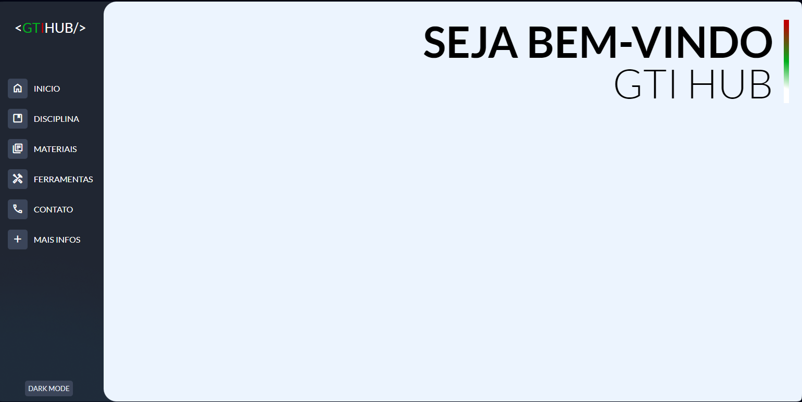

<h1 align="center"> Projeto GTI HUB </h1>

<h2 align="center">
  Projeto em desenvolvimento 🔃
</h2>

 

  Projeto de site em desenvolvimento para disciplina de Desenvolvimento Web II no curso de Gestão de TI do IFPR Campus Pinhais</b>

 

## Tecnologias

Esse projeto foi desenvolvido com as seguintes tecnologias:
- HTML, CSS e SASS
- JavaScript
- Git e Github
- Figma

 

## Layout

Você pode visualizar o layout do projeto através [DESSE LINK](https://www.figma.com/file/GYg5QDMm608vl6jW4X8Upx/Atividade-3---P%C3%A1gina-Dev-Web-II?type=design&node-id=0%3A1&mode=design&t=f7e7e1laFX96tp4n-1) 

 

É necessário ter conta na plataforma e solicitar convite para acessar o layout na página.

 

Ou também, segue abaixo uma imagem do projeto:

  

 

<a href="https://www.linkedin.com/in/renanolv/">Desenvolvido por - Renan Oliveira</a>
